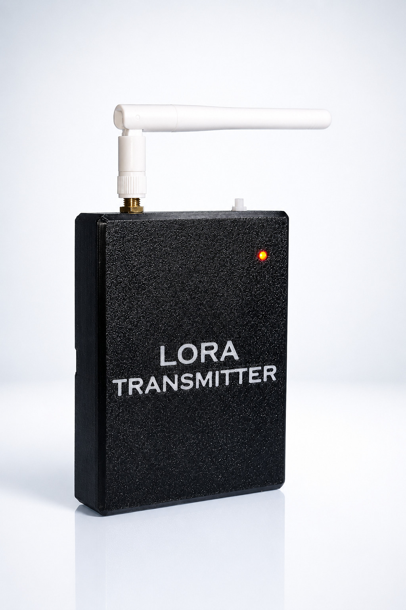
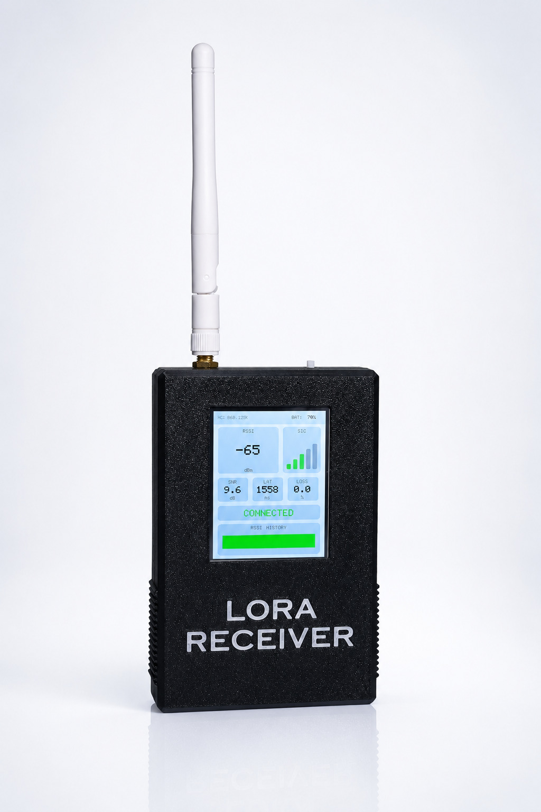
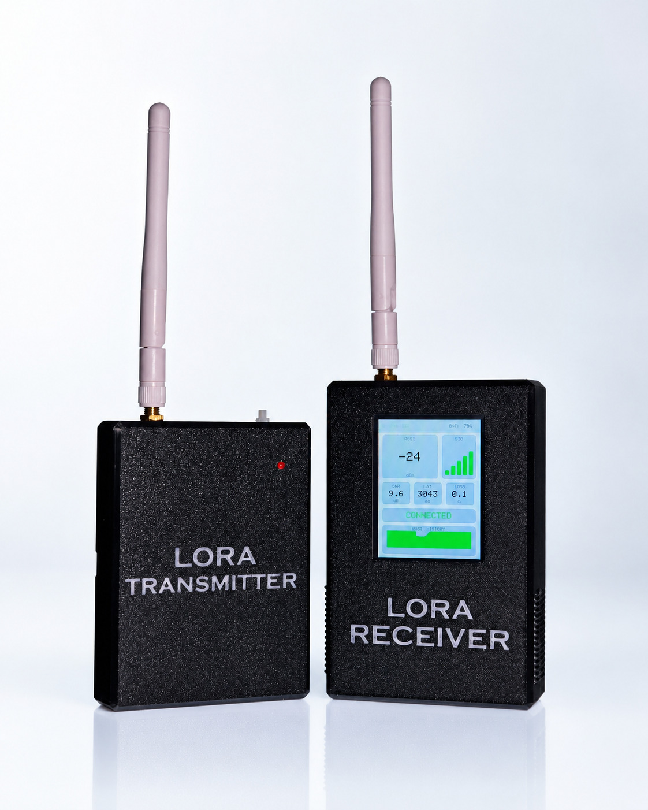
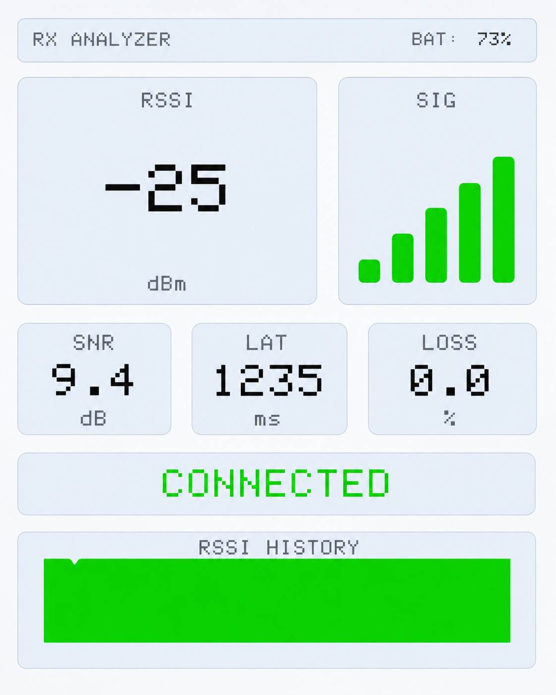
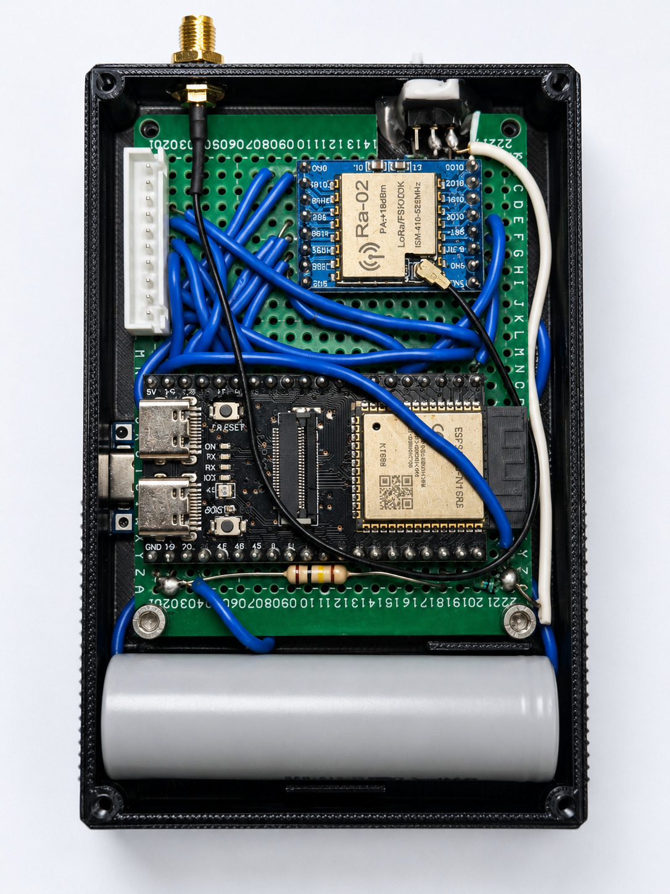
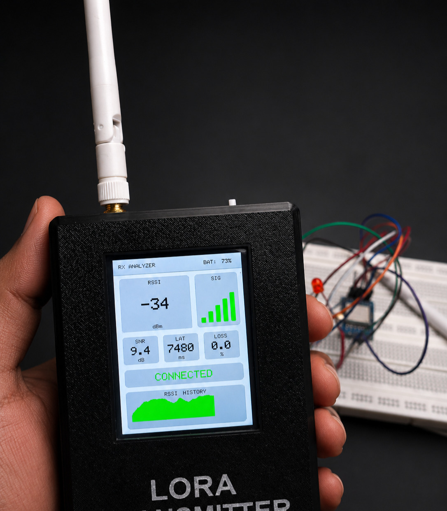
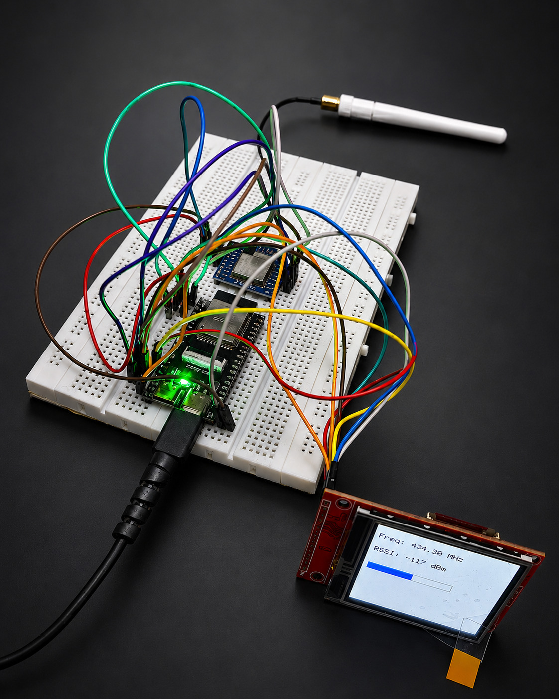

#  LoRa Signal Analyzer

A portable wireless link quality monitoring system built with two ESP32 + SX1278 devices. The transmitter continuously sends LoRa packets while the receiver measures and visualizes all communication metrics in real time on a 2.8" TFT dashboard — RSSI, SNR, latency, packet loss, and battery status.

---

## Repository Structure

```
LoRa-Signal-Monitor/
│
├── README.md
├── Images/
│   ├── tx.jpg                       # Transmitter hardware photo
│   ├── rx.jpg                       # Receiver hardware photo
│   ├── tx_rx.jpg                    # Both devices together
│   ├── dashboard.jpg                # TFT dashboard screenshot
│   ├── rx_wiring_final.jpg          # RX final wiring
│   ├── tx_wiring_breadboard.jpg     # TX breadboard testing
│   └── rx_wiring_breadboard.jpg     # RX breadboard testing
│
├── Hardware/
│   └── pin_connections.md           # ESP32 ↔ SX1278 pin mapping
│
├── Firmware/
│   ├── transmitter/                 # TX ESP32 firmware
│   └── receiver/                    # RX ESP32 firmware
│
├── 3D_Designs/
│   ├── enclosure_tx.stl             # TX printable enclosure
│   ├── enclosure_rx.stl             # RX printable enclosure
│   ├── enclosure_tx.f3d             # TX Fusion 360 source
│   └── enclosure_rx.f3d             # RX Fusion 360 source
│
└── Documentation/
    ├── project_report.pdf
    └── testing_results.pdf
```

---

##  Hardware

### Transmitter (TX)

| Component       | Details                  |
|----------------|--------------------------|
| Microcontroller | ESP32                   |
| LoRa Module     | SX1278                  |
| Battery         | 18650 Li-Ion Cell       |
| Charger         | TP4056 USB Charging Module |
| Boost Converter | MT3608                  |
| Enclosure       | Custom 3D Printed        |

### Receiver (RX)

| Component       | Details                  |
|----------------|--------------------------|
| Microcontroller | ESP32                   |
| LoRa Module     | SX1278                  |
| Display         | 2.8-inch SPI TFT         |
| Battery         | 18650 Li-Ion Cell        |
| Charger         | TP4056 USB Charging Module |
| Boost Converter | MT3608                   |
| Battery Monitor | Voltage Divider → ESP32 ADC |
| Enclosure       | Custom 3D Printed        |

---

##  Features

-  Real-time RSSI monitoring (signal strength in dBm)
-  Real-time SNR monitoring (signal-to-noise ratio in dB)
-  Latency measurement (packet travel time in ms)
-  Packet loss percentage calculation
-  Battery level monitoring on both TX and RX
-  Signal history graph on TFT dashboard
-  Compact 3D-printed handheld enclosures
-  USB rechargeable via TP4056

---

##  Metrics

| Metric      | Description                              | Unit |
|------------|------------------------------------------|------|
| RSSI        | Received signal power                   | dBm  |
| SNR         | Signal quality vs noise                 | dB   |
| Latency     | Packet travel time (RX time − TX time)  | ms   |
| Packet Loss | (Expected − Received) / Expected        | %    |
| Battery     | Voltage divider → ADC → %              | %    |

### RSSI Reference

| Quality   | Range               |
|-----------|---------------------|
| Excellent | −50 to −80 dBm     |
| Good      | −80 to −100 dBm    |
| Weak      | Below −110 dBm     |

### SNR Reference

| Quality   | Range          |
|-----------|----------------|
| Excellent | 10 to 15 dB   |
| Good      | 0 to 10 dB    |
| Poor      | Below 0 dB    |

---

##  Pin Connections

Full wiring tables for the ESP32 ↔ SX1278 connections are documented in [`Hardware/pin_connections.md`](Hardware/pin_connections.md).

---

##  Getting Started

### Prerequisites

- Arduino IDE or PlatformIO
- ESP32 board support installed
- Libraries:
  - `LoRa` by Sandeep Mistry
  - `Adafruit GFX` + TFT driver library (for RX display)

### Flashing Firmware

1. Open `Firmware/transmitter/` or `Firmware/receiver/` in Arduino IDE
2. Select Board: **ESP32 Dev Module**
3. Select the correct COM Port
4. Click **Upload**

> Flash the **TX** first, then the **RX**. Once both are powered, the RX dashboard will begin updating automatically.

---

##  Power System

```
18650 Battery
    ↓
TP4056 Charger (USB-C / micro-USB)
    ↓
Power Switch
    ↓
MT3608 Boost Converter
    ↓
ESP32 + Peripherals
```

---

##  Images

| Transmitter | Receiver | Both |
|:-----------:|:--------:|:----:|
|  |  |  |

| TFT Dashboard | RX Final Wiring |
|:-------------:|:---------------:|
|  |  |

| TX Breadboard Testing | RX Breadboard Testing |
|:---------------------:|:---------------------:|
|  |  |

---

##  3D Designs

The enclosures are designed for a compact, handheld form factor. Both TX and RX have individual enclosures optimized for their respective components.

| File | Description |
|------|-------------|
| `enclosure_tx.stl` | TX enclosure — ready to print |
| `enclosure_rx.stl` | RX enclosure — ready to print |
| `enclosure_tx.f3d` | TX Fusion 360 source (editable) |
| `enclosure_rx.f3d` | RX Fusion 360 source (editable) |

---

##  Applications

- LoRa range testing
- Wireless network diagnostics
- RF performance evaluation
- IoT deployment verification
- Field signal analysis
- Educational demonstrations

---

##  Future Improvements

- GPS integration for range mapping
- SD card data logging
- Mobile companion app
- Cloud synchronization
- OTA firmware updates
- Multi-node monitoring
- Advanced RF analytics

---

##  License

This project is open-source under the [MIT License](LICENSE).

---

##  Contributing

Pull requests are welcome! For major changes, please open an issue first to discuss what you'd like to change.
